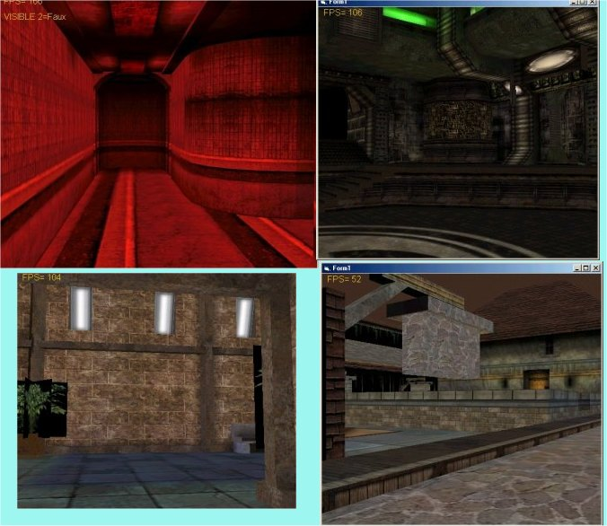



## NemoX 3d engine NOW load and render Quake 3 Level Map with lightmaps

### Description

This New version of NemoX

is faster than ever

Now NemoX can load and render Quake3 Level

with textures,lightmaps .

Only the visible surfaces are rendered with an optimized quake 3 BSP culling and frustum culling test..

Quake 2 models are also supported with fluid animation thanks to accurate linear keyframe interpolation...

One more time 700ko zipfile could not be uploaded

so download it at

http://perso.wanadoo.fr/malakoff/NemoBSPdemo.zip

THE FULL SOURCE CODE IS INCLUDED..

Feedbacks are welcomed
 
### More Info
 

             |
---                |---
**Submitted On**   |2002-09-02 05:47:50
**By**             |[polaris](https://github.com/Planet-Source-Code/PSCIndex/blob/master/ByAuthor/polaris.md)
**Level**          |Advanced
**User Rating**    |4.1 (29 globes from 7 users)
**Compatibility**  |VB 4\.0 \(32\-bit\), VB 5\.0, VB 6\.0
**Category**       |[DirectX](https://github.com/Planet-Source-Code/PSCIndex/blob/master/ByCategory/directx__1-44.md)
**World**          |[Visual Basic](https://github.com/Planet-Source-Code/PSCIndex/blob/master/ByWorld/visual-basic.md)
**Archive File**   |[NemoX\_3d\_e125587922002\.zip](https://github.com/Planet-Source-Code/polaris-nemox-3d-engine-now-load-and-render-quake-3-level-map-with-lightmaps__1-38588/archive/master.zip)

